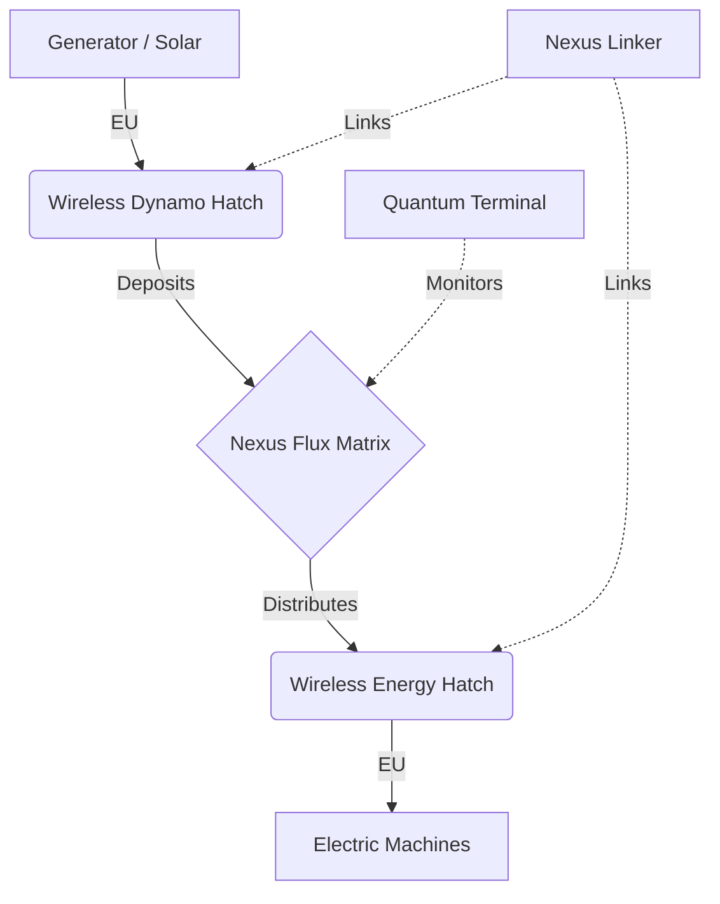

# :zap: Nexus Flux Matrix — Wireless Energy System

> **Status**: <span class="status-badge status-planned">🔮 In Development — v0.2.0</span>

## Overview

The **Nexus Flux Matrix** is a massive EU energy storage multiblock with wireless distribution. It works as an energy "central bank" where generators deposit and machines withdraw without cables.

## Quick Stats

| Property | Value |
|----------|-------|
| **Type** | Electric Multiblock (expandable) |
| **Size** | 3×7×7 (min) to 31×7×7 (max) |
| **Internal Capacitors** | Up to 750 blocks |
| **Scaling** | Quadratic: `Capacity × Count / 2` |
| **Efficiency** | 85% (LV) → 100% (MAX) |
| **Max Transfer** | 500 ZEU/t |
| **Cross-Dimension** | Yes (ZPM+) |
| **Safe Mode** | Auto at <10%, reactivates at 25% |

## Components

### Nexus Capacitor Blocks

Fill the interior of the multiblock. Each block adds capacity:

| Tier | Capacity/Block | Name |
|------|:---:|------|
| LV | 160K EU | Basic |
| MV | 1.5M EU | Advanced |
| HV | 10M EU | Elite |
| EV | 50M EU | Master |
| IV | 250M EU | Ultimate |
| LuV | 1.5G EU | Superior |
| ZPM | 15G EU | Quantum |
| UV | 150G EU | Stellar |
| UHV | 3T EU | Cosmic |
| UEV | 50T EU | Infinite |
| UIV | 900T EU | Ultra |
| UXV | 15P EU | Extreme |
| OpV | 250P EU | Omniscient |
| MAX | 5E EU | Omni |

### Calculation Formulas

#### Total Capacity
```
totalCapacity = Σ (capacitorCapacity[tier] × count) / 2
```

Scaling is **quadratic**: more capacitor blocks = bigger bonus. Division by 2 prevents excessive growth.

#### Efficiency by Tier
```
efficiency = 0.85 + (tier × 0.01071)
```

| Tier | Efficiency |
|------|:---:|
| LV | 85% |
| MV | 86.1% |
| HV | 87.1% |
| EV | 88.2% |
| IV | 89.3% |
| LuV | 90.4% |
| ZPM | 91.4% |
| UV | 92.5% |
| UHV | 93.6% |
| UEV | 94.6% |
| UIV | 95.7% |
| UXV | 96.8% |
| OpV | 97.9% |
| MAX | 100% |

#### Transfer Limit
The per-tick transfer limit is:
```
transferLimit = min(totalCapacity / 20, MAX_TRANSFER)
MAX_TRANSFER = 500 ZEU/t (Zetta EU per tick)
```

### Wireless Energy Hatch

Powers multiblocks by withdrawing from the wireless network. 11 amperage variants:

| Variant | Amperage |
|:---:|:---:|
| 1A | 1 |
| 4A | 4 |
| 16A | 16 |
| 64A | 64 |
| 256A | 256 |
| 1,024A | 1,024 |
| 4,096A | 4,096 |
| 16,384A | 16,384 |
| 65,536A | 65,536 |
| 262,144A | 262,144 |
| 1,048,576A | 1,048,576 |

Each variant is available across all tiers (LV → MAX).

### Wireless Dynamo Hatch

Receives from generators and deposits into the wireless network. Same amperage and tier variants.

### Wireless Covers (Singleblocks)

- **Receiver Cover**: Powers singleblocks (1A, 4A, 16A, 64A)
- **Transmitter Cover**: Extracts from singleblock generators

### Nexus Linker (Item)

Links components to the network via Shift+Click on Controller → Click on Hatch.

### Quantum Network Terminal (GUI)

Portable monitor showing:
- Current stored energy
- Input/Output rates (EU/t)
- Active connections list
- Estimated time remaining
- "Locate" button for each connection

## Safety System

| Level | Action |
|:---:|------|
| ≤75% | ⚠️ Chat warning |
| ≤50% | ⚠️ Chat warning |
| ≤25% | ⚠️ Urgent warning |
| ≤10% | ⛔ **Safe Mode**: cuts output, continues accepting input |
| ≥25% | 🔋 Safe Mode deactivated, output restored |

## Configuration

- `machines.nexusFluxMatrix.useHighestTierForEfficiency` is disabled by default.
- Disabled: efficiency uses the average tier of the installed capacitors.
- Enabled: efficiency uses only the highest tier present in the structure.
- This option used to be documented only in the PRD; now it is also in the player-facing wiki.

## Energy Flow



## Practical Example

1. Build the **Nexus Flux Matrix** (3×7×7 minimum)
2. Fill the interior with **Nexus Capacitors** of the desired tier
3. Use the **Nexus Linker**: Shift+Click on the Controller
4. Place **Wireless Dynamo Hatches** on your generators
5. Use the Linker to bind each Dynamo to the Controller
6. Place **Wireless Energy Hatches** on consumer machines
7. Use the Linker to bind each Energy Hatch
8. Monitor via **Quantum Network Terminal**

## Full PRD

For full technical implementation details, see: [PRD #5 — Nexus Flux Matrix](../../prd/prd_05_nexus_flux_matrix.md)
