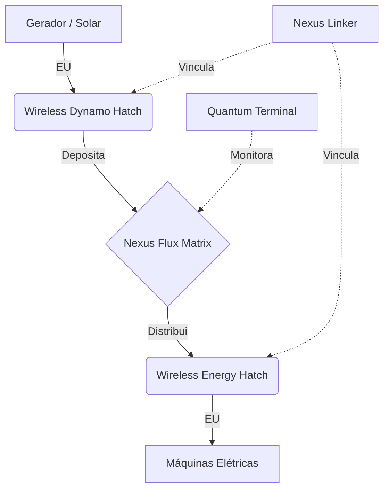

# ⚡ Nexus Flux Matrix — Wireless Energy System

> **Status**: <span class="status-badge status-planned">🔮 Em Desenvolvimento — v0.2.0</span>

## O que é

O **Nexus Flux Matrix** é um multiblocko de armazenamento massivo de energia EU com distribuição wireless. Funciona como um "banco central" de energia onde geradores depositam e máquinas sacam sem cabos.

## Stats Rápidos

| Propriedade | Valor |
|------------|-------|
| **Tipo** | Multiblocko Elétrico (expansível) |
| **Tamanho** | 3×7×7 (mín) até 31×7×7 (máx) |
| **Capacitors Internos** | Até 750 blocos |
| **Escalabilidade** | Quadrática — `Capacity × Count / 2` |
| **Eficiência** | 85% (LV) → 100% (MAX) |
| **Transfer Limit (MAX)** | 500 ZEU/t |
| **Cross-Dimension** | Sim (ZPM+) |
| **Safe Mode** | Auto em <10%, reativa em 25% |

## Componentes

### Nexus Capacitor Blocks

Preenche o interior do multibloco. Cada bloco adiciona capacidade:

| Tier | Capacidade/Bloco | Nome |
|------|:---:|------|
| LV | 160K EU | Basic |
| MV | 1.5M EU | Advanced |
| HV | 10M EU | Elite |
| EV | 50M EU | Master |
| IV | 250M EU | Ultimate |
| LuV | 1.5G EU | Superior |
| ZPM | 15G EU | Quantum |
| UV | 150G EU | Stellar |
| UHV | 3T EU | Cosmic |
| UEV | 50T EU | Infinite |
| UIV | 900T EU | Ultra |
| UXV | 15P EU | Extreme |
| OpV | 250P EU | Omniscient |
| MAX | 5E EU | Omni |

### Fórmulas de Cálculo

#### Capacidade Total
```
totalCapacity = Σ (capacitorCapacity[tier] × count) / 2
```

A escalabilidade é **quadrática**: quanto mais blocos de capacitor, maior o bônus. A divisão por 2 impede crescimento excessivo.

#### Eficiência por Tier
```
efficiency = 0.85 + (tier × 0.01071)
```

| Tier | Eficiência |
|------|:---:|
| LV | 85% |
| MV | 86.1% |
| HV | 87.1% |
| EV | 88.2% |
| IV | 89.3% |
| LuV | 90.4% |
| ZPM | 91.4% |
| UV | 92.5% |
| UHV | 93.6% |
| UEV | 94.6% |
| UIV | 95.7% |
| UXV | 96.8% |
| OpV | 97.9% |
| MAX | 100% |

#### Limite de Transferência
O limite de transferência por tick é:
```
transferLimit = min(totalCapacity / 20, MAX_TRANSFER)
MAX_TRANSFER = 500 ZEU/t (Zetta EU por tick)
```

### Wireless Energy Hatch

Alimenta multiblocos sacando da rede wireless. 11 variantes de amperagem:

| Variante | Amperagem |
|:---:|:---:|
| 1A | 1 |
| 4A | 4 |
| 16A | 16 |
| 64A | 64 |
| 256A | 256 |
| 1,024A | 1,024 |
| 4,096A | 4,096 |
| 16,384A | 16,384 |
| 65,536A | 65,536 |
| 262,144A | 262,144 |
| 1,048,576A | 1,048,576 |

Cada variante está disponível em todos os tiers (LV → MAX).

### Wireless Dynamo Hatch

Recebe de geradores e deposita na rede wireless. Mesmas variantes de amperagem e tier.

### Wireless Covers (Singleblocks)

- **Receiver Cover**: Alimenta singleblocks (1A, 4A, 16A, 64A)
- **Transmitter Cover**: Extrai de geradores singleblock

### Nexus Linker (Item)

Vincula componentes à rede via Shift+Click no Controller → Click no Hatch.

### Quantum Network Terminal (GUI)

Monitor portátil com:
- Energia atual armazenada
- Taxa de Input/Output (EU/t)
- Lista de conexões ativas
- Tempo restante estimado
- Botão "Localizar" para cada conexão

## Sistema de Segurança

| Nível | Ação |
|:---:|------|
| ≤75% | ⚠️ Aviso no chat |
| ≤50% | ⚠️ Aviso no chat |
| ≤25% | ⚠️ Aviso urgente |
| ≤10% | ⛔ **Safe Mode**: corta output, continua aceitando input |
| ≥25% | 🔋 Safe Mode desativado, output restaurado |

## Configuração

- `machines.nexusFluxMatrix.useHighestTierForEfficiency` vem desativado por padrão.
- Desativado: a eficiência usa a média dos tiers dos capacitores instalados.
- Ativado: a eficiência usa apenas o maior tier presente na estrutura.
- Essa opção existia descrita só no PRD; agora ela também faz parte da wiki para consulta dos jogadores e pack devs.

## Fluxo de Energia



## Exemplo Prático

1. Construa o **Nexus Flux Matrix** (3×7×7 mínimo)
2. Preencha o interior com **Nexus Capacitors** do tier desejado
3. Use o **Nexus Linker**: Shift+Click no Controller
4. Coloque **Wireless Dynamo Hatches** nos seus geradores
5. Use o Linker para vincular cada Dynamo ao Controller
6. Coloque **Wireless Energy Hatches** nas máquinas consumidoras
7. Use o Linker para vincular cada Energy Hatch
8. Monitore via **Quantum Network Terminal**

## PRD Completo

Para detalhes técnicos de implementação, veja: [PRD #5 — Nexus Flux Matrix](../../prd/prd_05_nexus_flux_matrix.md)
