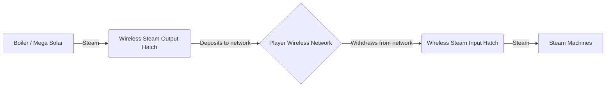

# :satellite: Wireless Steam Network

## How it Works

Each player has their own independent **wireless steam network**, identified by their UUID. The system uses `SteamNetworkData` (a Minecraft `SavedData`) to globally store and manage steam on the server.

## Components

### Wireless Steam Output Hatch
- Connect to a **Boiler** or any steam source
- **Sends** steam to your global wireless network
- Variants: Bronze (limited capacity) and **Steel** (`Integer.MAX_VALUE` capacity)

### Wireless Steam Input Hatch
- Connect to any **steam machine** that needs steam
- **Receives** steam directly from your wireless network
- Variants: Bronze and **Steel**

## Technical Specifications

| Property | Value |
|----------|-------|
| **Distance Limit** | ♾️ None (works across dimensions!) |
| **Per-Player Network** | Yes — based on unique UUID |
| **Transfer Rate** | Configurable via config: `wirelessSteamTransferRate` |
| **Persistence** | `SavedData` — auto-saved with the world |
| **Capacity (Bronze)** | ~2 Billion mB (Integer.MAX_VALUE) |
| **Capacity (Steel)** | ~2 Billion mB (Integer.MAX_VALUE) |

## Data Flow

## Tips

!!! tip "Maximize your production"
    - Switch to **Steel Wireless Hatches** as soon as possible
    - A single **Mega Solar Boiler** with Wireless Output can power your entire factory
    - Centralize steam production in one massive boiler and distribute wirelessly
    - No need to worry about distance — the network works globally

!!! info "How to Set Up"
    1. Place a **Wireless Steam Output Hatch** on your boiler
    2. Place a **Wireless Steam Input Hatch** on the machine that needs steam
    3. Done! Binding is automatic based on the player's UUID
