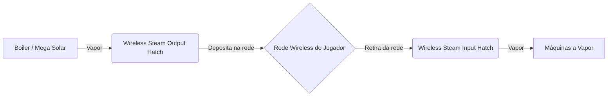

# 📡 Wireless Steam Network

## Como Funciona

Cada jogador possui sua própria **rede wireless de vapor** independente, identificada pelo UUID do jogador. O sistema utiliza `SteamNetworkData` (um `SavedData` do Minecraft) para armazenar e gerenciar o vapor de forma global no servidor.

## Componentes

### Wireless Steam Output Hatch
- Conecte a um **Boiler** ou qualquer fonte de vapor
- **Envia** vapor para sua rede wireless global
- Variantes: Bronze (capacidade limitada) e **Steel** (capacidade `Integer.MAX_VALUE`)

### Wireless Steam Input Hatch
- Conecte a qualquer **máquina a vapor** que precise de vapor
- **Recebe** vapor diretamente da sua rede wireless
- Variantes: Bronze e **Steel**

## Especificações Técnicas

| Propriedade | Valor |
|-------------|-------|
| **Limite de Distância** | ♾️ Sem limite (funciona entre dimensões!) |
| **Rede por Jogador** | Sim — baseada em UUID único |
| **Taxa de Transferência** | Configurável via config: `wirelessSteamTransferRate` |
| **Persistência** | `SavedData` — salvo automaticamente com o mundo |
| **Capacidade (Bronze)** | ~2 Bilhões mB (Integer.MAX_VALUE) |
| **Capacidade (Steel)** | ~2 Bilhões mB (Integer.MAX_VALUE) |

## Fluxo de Dados

## Dicas de Uso

!!! tip "Maximize sua produção"
    - Troque para **Wireless Hatches de Steel** o mais rápido possível — a variante Bronze tem limite menor
    - Um único **Mega Solar Boiler** com Wireless Output pode alimentar toda sua fábrica
    - Centralize a produção de vapor em um boiler gigante e distribua wirelessly
    - Não precisa se preocupar com distância — a rede funciona globalmente

!!! info "Como Configurar"
    1. Coloque uma **Wireless Steam Output Hatch** no seu boiler
    2. Coloque uma **Wireless Steam Input Hatch** na máquina que precisa de vapor
    3. Pronto! O vinculo é automático pelo UUID do jogador
