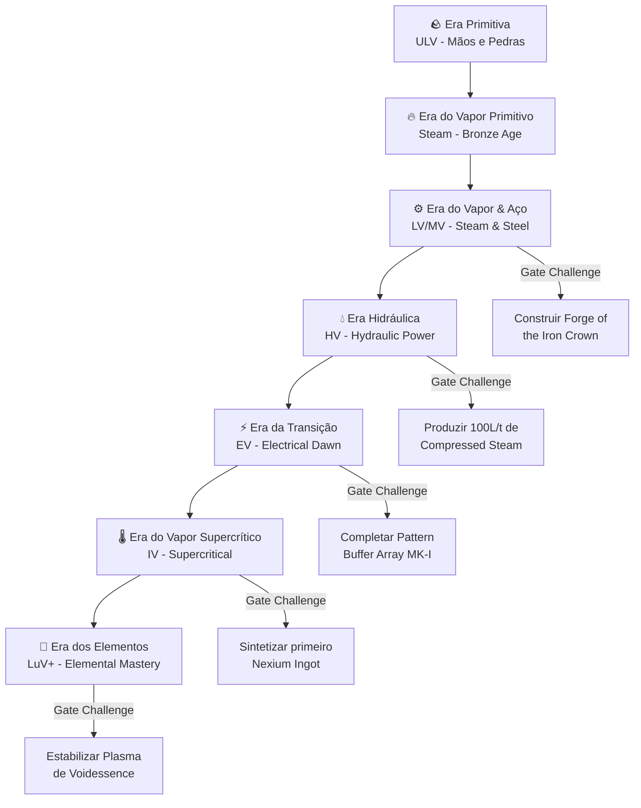

# 🎮 PRD #1 — GTNA Game Design Master Document
## GregTech Nexus Addon — Product Requirements Document
### Versão 1.0 | Bilíngue PT-BR / EN

---

## 📋 Índice / Table of Contents

1. [Visão Geral / Overview](#1-visão-geral--overview)
2. [Filosofia de Design / Design Philosophy](#2-filosofia-de-design--design-philosophy)
3. [Arquitetura de Eras / Era Architecture](#3-arquitetura-de-eras--era-architecture)
4. [Era do Vapor & Aço / Steam & Steel Era](#4-era-do-vapor--aço--steam--steel-era)
5. [Novos Multiblocos / New Multiblocks](#5-novos-multiblocos--new-multiblocks)
6. [Novos Elementos Químicos / New Chemical Elements](#6-novos-elementos-químicos--new-chemical-elements)
7. [Novas Ligas Metálicas / New Metal Alloys](#7-novas-ligas-metálicas--new-metal-alloys)
8. [Novos Fluidos / New Fluids](#8-novos-fluidos--new-fluids)
9. [Sistema Pattern Buffer / Pattern Buffer System](#9-sistema-pattern-buffer--pattern-buffer-system)
10. [Melhorias ao Mod Base / Base Mod Improvements](#10-melhorias-ao-mod-base--base-mod-improvements)
11. [Mecânicas de QoL / Quality of Life Mechanics](#11-mecânicas-de-qol--quality-of-life-mechanics)
12. [Tabela de Cálculos / Calculation Tables](#12-tabela-de-cálculos--calculation-tables)
13. [Créditos e Inspirações / Credits and Inspirations](#13-créditos-e-inspirações--credits-and-inspirations)

---

## 1. Visão Geral / Overview

**PT-BR**: O GregTech Nexus Addon (GTNA) é um addon para GregTech CEu Modern 1.20.1 que expande fundamentalmente a experiência de jogo, começando pela era do Vapor & Aço e eventualmente alcançando tecnologias cósmicas. Cada mecânica adicionada é projetada para dar ao jogador um benefício tangível e significativo, justificando o investimento de recursos e tempo.

**EN**: GregTech Nexus Addon (GTNA) is an addon for GregTech CEu Modern 1.20.1 that fundamentally expands the gameplay experience, starting from the Steam & Steel era and eventually reaching cosmic technologies. Every mechanic added is designed to give the player a tangible and significant benefit, justifying the investment of resources and time.

### Status Atual / Current Status

| Feature | Status | Versão |
|---------|--------|--------|
| Wireless Steam Network | ✅ Implementado | 0.1.5 |
| Sistema Hidráulico | ✅ Implementado | 0.1.5 |
| Multiblocos a Vapor (8) | ✅ Implementado | 0.1.5 |
| Thread/Accelerate/Overclock Hatches | ✅ Implementado | 0.1.5 |
| Advanced Parallel Hatches | ✅ Implementado | 0.1.5 |
| Pattern Buffer System | 🔄 Planejado | 0.2.0 |
| Novos Elementos | 🔄 Planejado | 0.2.0 |
| Novas Ligas | 🔄 Planejado | 0.2.0 |
| Era Hidráulica Completa | 🔄 Planejado | 0.3.0 |

---

## 2. Filosofia de Design / Design Philosophy

### Os 5 Pilares do GTNA / The 5 Pillars of GTNA

```
┌─────────────────────────────────────────────────────────────┐
│                    FILOSOFIA GTNA                           │
│                                                             │
│  1. RECOMPENSA JUSTA     - Trabalho duro = benefício real   │
│  2. PROGRESSÃO ORGÂNICA  - Cada era prepara a próxima       │
│  3. DESAFIO CALCULADO    - Difícil, mas nunca injusto       │
│  4. AUTOMAÇÃO ELEGANTE   - Menos pipe-spaghetti             │
│  5. LORE IMERSIVO        - Cada máquina conta uma história  │
└─────────────────────────────────────────────────────────────┘
```

**Regra de Ouro**: Se um multiblocko custa X recursos para construir, ele deve economizar pelo menos 3X em recursos ao longo de seu uso normal, OU reduzir o tempo de processamento em pelo menos 60%, OU desbloquear algo impossível de fazer de outra forma.

**Escala de Dificuldade GTNA**: 5/10 comparado ao GTNH (10/10). O GTNA é desafiador mas acessível. O jogador nunca deve se sentir perdido — sempre deve existir uma dica no tooltip ou na máquina explicando o próximo passo.

---

## 3. Arquitetura de Eras / Era Architecture

### Mapa de Progressão Completo



### Detalhamento da Era do Vapor & Aço (FOCO PRINCIPAL v0.2.0)

| Aspecto | Detalhe |
|---------|---------|
| **Voltage Tier** | LV (32 EU/t) → MV (128 EU/t) |
| **Materiais-Chave** | Stronze, Breel, CompressedSteam, Novas ligas |
| **Steam Throughput** | 20,000 L/s → 500,000 L/s |
| **Novos Multiblocos** | 5 (detalhados abaixo) |
| **Gate Challenge** | Construir a "Forge of the Iron Crown" |
| **Duração Estimada** | 8-15 horas de gameplay |
| **Benefício ao Completar** | Desbloqueio do Hydraulic Fabricator + 4x throughput em todas as máquinas a vapor |

---

## 4. Era do Vapor & Aço / Steam & Steel Era

### 4.1 Desafios da Era / Era Challenges

O jogador que completa a Era do Vapor & Aço precisa:

1. **Dominar o Steam Network** — Ter pelo menos 100,000 L/t de Steam no sistema wireless
2. **Produzir Stronze** — Necessário para quase todos os multiblocos novos
3. **Construir a Forge of the Iron Crown** — Gate para a próxima era
4. **Automatizar pelo menos 3 multiblocos** — Usando sistema wireless + AE2 básico

### 4.2 Árvore de Progressão da Era

```
Bronze Tools → Steam Boiler → Wireless Steam → Large Steam Furnace
                                    ↓
                              Stronze Production → Stone Superheater
                                    ↓              → Steam Cobbler
                              Breel Production  → Steam Manufacturer
                                    ↓
                         Steam Pressure Crystallizer → novos materiais
                                    ↓
                         Forge of the Iron Crown ← requer todos acima
                                    ↓
                              ERA HIDRÁULICA
```

### 4.3 Tabela de Eficiência Comparativa

| Processo | Singleblock GT | Multiblocko GTNA | Melhoria |
|----------|---------------|-------------------|----------|
| Furnace (Smelting) | 1x speed, 100% steam | 9x speed, 50% steam | **18x melhor** |
| Alloy Smelting | 1x speed, 100% steam | 1.43x speed, 64 parallel | **~92x throughput** |
| Macerating | 1x speed, 100% steam | 2x speed, 32 parallel | **~64x throughput** |
| Rock Breaking | Manual/1x | 16 parallel, auto | **Infinito** |
| Woodcutting | Manual | 32 parallel, auto | **Infinito** |

---

## 5. Novos Multiblocos / New Multiblocks

---

### 5.1 ⚒️ Forge of the Iron Crown / Forja da Coroa de Ferro

> *"In the age before electricity, the masters of steam forged crowns of iron to bend steel to their will. This forge remembers."*
> 
> *"Na era antes da eletricidade, os mestres do vapor forjaram coroas de ferro para dobrar o aço à sua vontade. Esta forja se lembra."*

#### O que é / What it is
**PT-BR**: A Forja da Coroa de Ferro é o multiblocko definitivo da Era do Vapor & Aço. É uma estrutura massiva (11x9x11) que funciona como um **EBF (Electric Blast Furnace) movido a vapor**, capaz de processar receitas de blast que normalmente exigiriam LV ou MV de energia elétrica. Ela permite ao jogador **pular temporariamente a necessidade de montar um sistema elétrico** para certas ligas essenciais.

**EN**: The Forge of the Iron Crown is the ultimate multiblock of the Steam & Steel Era. It's a massive structure (11x9x11) that functions as a **steam-powered EBF (Electric Blast Furnace)**, capable of processing blast recipes that would normally require LV or MV electrical power. It allows the player to **temporarily bypass the need for an electrical setup** for certain essential alloys.

#### Função Detalhada / Detailed Function
- **Tipo de Receita**: Blast Recipes com temperatura ≤ 1800K
- **Entrada**: Items + Steam (sem EU!)
- **Saída**: Lingotes, pós processados, ligas
- **Temperatura Máxima**: 1800K (equivalente a Cupronickel Coils no EBF padrão)
- **Paralelismo**: Até 8 receitas simultâneas

#### Exemplos de Uso Real / Real Use Examples

| Cenário | Receita | Sem Forge | Com Forge | Benefício |
|---------|---------|-----------|-----------|-----------|
| **Fazer Steel Ingots** | Iron Dust → Steel Ingot (1000K) | Precisa EBF + LV energia | Só precisa de Steam | Elimina necessidade de LV |
| **Produzir Aluminium** | Aluminium Dust → Ingot (1700K) | Precisa EBF + MV energia | Só precisa de Steam + muitos recursos | Adianta produção |
| **Ligas Stronze/Breel** | Componentes → Liga (1123K) | Precisa EBF | Steam-powered | Bootstrapping facilitado |
| **Silicon Boule** | Silicon → Boule (1687K) | EBF + MV | Steam (lento, mas possível) | Circuitos iniciais sem eletricidade |

#### Mecânicas Especiais / Special Mechanics

1. **Pressão Variável**: A temperatura máxima depende de quantos blocos de "Pressure Core" estão no interior. Cada core adiciona +100K à capacidade máxima.
   - Mínimo (3 cores): 1200K
   - Máximo (6 cores): 1800K
   
2. **Steam Overclock**: Injeta mais steam para acelerar o processo. A cada 2x de steam, a velocidade aumenta em 50%. Máximo 4x steam para 3x velocity.
   
3. **Cinza Residual**: A cada 100 operações, produz "Forge Ash" como subproduto. Esse ash pode ser reciclado no Stone Superheater para produzir fluidos raros.

4. **Crown Bonus**: Se a estrutura é construída com Stronze em vez de Bronze para os casings, TODAS as receitas ganham +10% velocidade permanente (o "Crown" reconhece materiais superiores).

#### Custo de Construção / Construction Cost

| Material | Quantidade | Alternativa |
|----------|-----------|-------------|
| Bronze Plated Bricks | 280 blocos | - |
| Stronze Casing (opcional) | 280 blocos | Bronze Plated Bricks |
| Steel Pipe Casing | 36 blocos | - |
| Bronze Firebox | 18 blocos | - |
| Pressure Core (novo bloco) | 3-6 blocos | - |
| Iron Frame | 48 blocos | - |
| Glass | 24 blocos | - |
| Steam Hatch | 1-4 | - |
| Item Input Bus | 1-2 | - |
| Item Output Bus | 1-2 | - |

#### Cálculos de Eficiência / Efficiency Calculations

```
Base Speed = GT_Recipe_Duration × 2.5 (mais lento que EBF elétrico)
Steam Cost = GT_Recipe_EU × 16 (conversão EU → Steam)
Parallel Modifier = min(8, floor(Pressure_Cores / 1))

Com Crown Bonus (Stronze):
  Speed = Base_Speed × 0.9
  
Com Steam Overclock:
  Speed = Base_Speed / (1 + 0.5 × OC_Level)  [OC_Level: 0-3]
  Steam = Base_Steam × (2 ^ OC_Level)

Exemplo: Steel Ingot (5s no EBF LV)
  Forge Speed = 5 × 2.5 = 12.5s base
  Com 4x OC = 12.5 / 2.5 = 5s
  Steam Cost = 30 EU/t × 16 = 480L/t
  Com 4x OC = 480 × 8 = 3840 L/t
```

#### Por que construir? / Why build it?

> [!TIP]
> **A Forge é essencial se você quer:**
> - Produzir ligas avançadas SEM ter um sistema elétrico montado
> - Fazer bootstrapping massivo de Steel e Aluminium usando apenas Steam
> - Pular direto para produção de Stronze/Breel sem EBF
> - Ter um sistema redundante pra caso sua energia falhe
> - Processar 8 receitas de blast ao mesmo tempo no early game

---

### 5.2 💎 Steam Pressure Crystallizer / Cristalizador de Pressão a Vapor

> *"Under crushing steam pressure, ordinary minerals reveal their crystalline secrets. This machine does not create — it reveals what was always hidden within."*
>
> *"Sob pressão esmagadora de vapor, minerais comuns revelam seus segredos cristalinos. Esta máquina não cria — ela revela o que sempre esteve escondido."*

#### O que é / What it is
**PT-BR**: O Cristalizador transforma materiais brutos em versões cristalinas purificadas. Ele é ESSENCIAL porque muitas receitas avançadas do GTNA exigem "Crystalline" variants de materiais que não existem no GT base. Pense nele como uma Autoclave turbinada movida a vapor.

**EN**: The Crystallizer transforms raw materials into purified crystalline versions. It's ESSENTIAL because many advanced GTNA recipes require "Crystalline" variants of materials that don't exist in base GT. Think of it as a supercharged steam-powered Autoclave.

#### Função Detalhada / Detailed Function
- **Tipo de Receita**: Autoclave Recipes + Novas receitas cristalinas exclusivas
- **Entrada**: Dusts, Gems, Liquids + Steam em alta pressão
- **Saída**: Crystalline materials, gems purificadas, cristais de circuito
- **Estrutura**: 5x5x5 (compacta mas cara)
- **Paralelismo**: Até 16 receitas simultâneas

#### Exemplos de Uso Real / Real Use Examples

| Cenário | Input | Output | Benefício vs Manual |
|---------|-------|--------|---------------------|
| **Cristais para Circuitos** | Quartzite Dust + Steam | Purified Quartz Crystal (2x) | 2x yield, sem precisar de eletricidade |
| **Gems Perfeitos** | Impure Ruby Dust + High-Pressure Steam | Flawless Ruby | Normalmente requer EV-tier |
| **Crystalline Stronze** | Stronze Dust + Compressed Steam | Crystalline Stronze (novo) | Material exclusivo para Pattern Buffer |
| **Fluido Cristalino** | Lava + Steam (5000 L/t) | Crystal Coolant (novo fluido) | Resfriamento para Forge of Iron Crown |

#### Mecânicas Especiais / Special Mechanics

1. **Pressure Tiers**: A pressão interna determina quais receitas são acessíveis:
   - Pressão Normal (20,000 L/t): Receitas básicas de autoclave
   - Alta Pressão (50,000 L/t): Gems purificadas, cristais intermediários
   - Ultra Pressão (100,000 L/t): Crystalline Stronze, Crystal Coolant
   
2. **Seed Crystal**: Para receitas avançadas, você pode adicionar um "Seed Crystal" (Crystal Lens) no slot de circuito para aumentar a qualidade do output em 25%.

3. **Resonance Chamber**: Se 4 das paredes são feitos de Borosilicate Glass (já existente no mod), a velocidade de cristalização aumenta em 40%.

#### Custo de Construção / Construction Cost

| Material | Quantidade |
|----------|-----------|
| Stronze Wrapped Casing | 80 blocos |
| Borosilicate Glass | 24 blocos (opcional, para resonance) |
| Bronze Pipe Casing | 12 blocos |
| Hyper Pressure Breel Casing | 6 blocos (centro) |
| Steam Hatch | 2-4 |
| Item I/O Bus | 1-2 cada |
| Fluid I/O Hatch | 1-2 cada |

#### Cálculos / Calculations

```
Base Duration por receita = 200 ticks (10s)
Steam Consumption = 2000 L/t (pressão normal)
Paralelismo efetivo = min(16, Steam_disponível / 2000)

Com Resonance (Borosilicate):
  Duration = Base × 0.6 (40% mais rápido)

Com Seed Crystal:
  Output_quality × 1.25

Throughput exemplo (16 parallel, resonance):
  16 × (20/tick) / (200 × 0.6) = 2.67 stacks/s de output
  Steam: 16 × 2000 = 32,000 L/t
```

#### Por que construir? / Why build it?

> [!TIP]
> **O Cristalizador é essencial se você quer:**
> - Produzir Crystalline Stronze (necessário para Pattern Buffer)
> - Dobrar o yield de gems sem necessitar de eletricidade
> - Criar Crystal Coolant (usado em 5+ receitas avançadas)
> - Purificar materiais em massa (16 paralelos!)
> - Ter acesso antecipado a materiais normalmente locked atrás de tiers elétricos

---

### 5.3 🌊 Pneumatic Ore Washer / Lavador Pneumático de Minérios

> *"The old miners used to wash gold with river water. The Nexus engineers washing minério with a hurricane of compressed steam. Same principle. Different scale."*
>
> *"Os velhos mineradores lavavam ouro com água de rio. Os engenheiros Nexus lavam minério com um furacão de vapor comprimido. Mesmo princípio. Escala diferente."*

#### O que é / What it is
**PT-BR**: Um multiblock massivo (7x5x7) que combina as funções de Ore Washer + Chemical Bath + Centrifuge em uma única estrutura movida a vapor. Ele processa minérios do início ao fim: de crushed ore → purified ore → refined dust. Tudo em um único multiblocko.

**EN**: A massive multiblock (7x5x7) combining the functions of Ore Washer + Chemical Bath + Centrifuge in a single steam-powered structure. It processes ores from start to finish: crushed ore → purified ore → refined dust. All in one multiblock.

#### Função Detalhada / Detailed Function
- **Mode Selector**: 3 modos via Programmed Circuit
  - Circuit 1: Ore Washing (Crushed → Purified)
  - Circuit 2: Chemical Bath (Purified → Refined)
  - Circuit 3: Full Pipeline (Crushed → Refined, automático)
- **Paralelismo**: 32 por modo (64 no modo Full Pipeline com 2x steam)
- **Subprodutos**: Todos os subprodutos de cada estágio são coletados

#### Exemplos de Uso Real / Real Use Examples

| Cenário | Modo | Input | Output | Steam/t |
|---------|------|-------|--------|---------|
| **Copper full chain** | Pipeline | 64 Crushed Copper Ore | 64 Refined Copper Dust + subprodutos | 8,000 L/t |
| **Iron washing** | Wash Only | 32 Crushed Iron Ore | 32 Purified Iron Ore + Stone Dust | 2,000 L/t |
| **Gold refining** | Bath | 32 Purified Gold Ore | 32 Refined Gold Dust + Silver | 4,000 L/t |
| **Mass processing** | Pipeline | Misto (vários ores) | Tudo processado automaticamente | 12,000 L/t |

#### Mecânicas Especiais / Special Mechanics

1. **Cascade Processing**: No modo Pipeline, o minério passa pelos 3 estágios internamente sem precisar de outpute e re-input. Isso economiza tempo e energia.
   
2. **Subproduct Collection**: Todos os subprodutos (Stone Dust, Small Dust, etc.) são coletados separadamente em output buses dedicados.

3. **Fluid Recycling**: A água usada na lavação é parcialmente reciclada (60%), reduzindo o consumo real de água.

4. **Overclock com Heated Water**: Se você usar Hot Water (do Steam Boiler) no lugar de Water normal, a velocidade de todas as operações aumenta em 30%.

#### Custo de Construção / Construction Cost

| Material | Quantidade |
|----------|-----------|
| Bronze Plated Bricks | 160 blocos |
| Steel Solid Casing | 24 blocos |
| Bronze Pipe Casing | 18 blocos |
| Iron Frame | 32 blocos |
| Steam Hatch | 2-4 |
| Item I/O | 2-3 cada |
| Fluid I/O | 2 cada |

#### Por que construir? / Why build it?

> [!TIP]
> **O Lavador Pneumático é essencial se você quer:**
> - Processar minérios do início ao fim sem trocar de máquina
> - 64 paralelos no modo Pipeline (insano para early game!)
> - Subprodutos automáticos (nunca perder aquele Small Platinum Dust)
> - 60% menos consumo de água via reciclagem
> - Velocidade 30% extra usando Hot Water

---

### 5.4 🧪 Steam Distillation Column / Coluna de Destilação a Vapor

> *"Before electricity tamed the lightning, the alchemists knew: heat rises, and with it, the essence of all things separates. This tower is their legacy, perfected."*
>
> *"Antes de a eletricidade domar o relâmpago, os alquimistas sabiam: o calor sobe, e com ele, a essência de todas as coisas se separa. Esta torre é seu legado, aperfeiçoado."*

#### O que é / What it is
**PT-BR**: Uma torre alta (3x11x3) que funciona como uma Distillation Tower simplificada, movida a vapor. Ela pode separar fluidos complexos em seus componentes sem necessidade de eletricidade. É VITAL para produzir os fluidos necessários para a Era Hidráulica.

**EN**: A tall tower (3x11x3) functioning as a simplified steam-powered Distillation Tower. It can separate complex fluids into their components without electricity. VITAL for producing the fluids needed for the Hydraulic Era.

#### Função Detalhada / Detailed Function
- **Tipo de Receita**: Distillation Recipes simplificadas (subset do GT base)
- **Limitação**: Apenas receitas com temperatura ≤ 500°C
- **Outputs**: Até 6 fluidos diferentes + 1 item (mesmo layout da DT padrão)
- **Paralelismo**: 4 (limitado pelo tamanho compacto)

#### Exemplos de Uso Real / Real Use Examples

| Input Fluid | Outputs | Steam/t | Por que é útil |
|-------------|---------|---------|----------------|
| **Oil** | Light Fuel, Heavy Fuel, Naphtha, Gas | 6,000 L/t | Combustíveis para boilers avançados |
| **Fermented Biomass** | Ethanol, Methanol, Acetic Acid | 3,000 L/t | Químicos para receitas |
| **Compressed Steam (líquido)** | Dense Supercritical Steam, SuperHeated Steam | 8,000 L/t | Combustíveis de vapor avançados |
| **Water** | Distilled Water (pura) | 1,000 L/t | Qualidade superior para cristalizador |

#### Mecânicas Especiais / Special Mechanics

1. **Height = Efficiency**: Cada camada extra na torre (até 11 max) adiciona +1 output slot. Torre de 5 camadas = 3 outputs. Torre de 11 = 6 outputs.

2. **Condensation Recovery**: 15% do fluido que evapora é recapturado e reinjetado, economizando input.

3. **Temperature Gradient**: A temperatura diminui de baixo para cima. Fluidos com menor ponto de ebulição saem no topo (mais puro), enquanto os mais pesados saem embaixo.

#### Custo de Construção / Construction Cost

| Material | Quantidade |
|----------|-----------|
| Stronze Wrapped Casing | 60-120 (depende da altura) |
| Bronze Pipe Casing | 9-27 (interior) |
| Borosilicate Glass | 8-16 (para observação) |
| Steam Hatch | 2 |
| Fluid Output Hatch | 3-6 |
| Item Output Bus (ash) | 1 |

#### Por que construir? / Why build it?

> [!TIP]
> **A Coluna de Destilação é essencial se você quer:**
> - Produzir combustível refinado SEM eletricidade
> - Acesso antecipado a fluidos normalmente locked atrás de IV+
> - Desconstruir Compressed Steam em variantes avançadas
> - Setup compacto (3x3 footprint)
> - Gate challenge para a próxima era requer fluidos dela

---

### 5.5 🔨 Hydraulic Press Complex / Complexo de Prensa Hidráulica

> *"When a thousand atmospheres of steam pressure meet raw metal, the metal has no choice but to obey. Plates, rods, gears — shaped not by tools, but by the will of the machine."*
>
> *"Quando mil atmosferas de pressão de vapor encontram metal bruto, o metal não tem escolha senão obedecer. Placas, varetas, engrenagens — moldados não por ferramentas, mas pela vontade da máquina."*

#### O que é / What it is
**PT-BR**: O Complexo de Prensa Hidráulica unifica todas as operações de formar metal em uma única estrutura: Bender, Compressor, Forge Hammer, Forming Press e Extruder. É o multiblocko de "fabricação" da Era do Vapor & Aço, complementando o Steam Manufacturer que já existe.

**EN**: The Hydraulic Press Complex unifies all metal-forming operations into a single structure: Bender, Compressor, Forge Hammer, Forming Press, and Extruder. It is the "fabrication" multiblock of the Steam & Steel Era, complementing the existing Steam Manufacturer.

#### Função Detalhada / Detailed Function
- **Receitas Suportadas**: 
  - Bender Recipes (placas, curvas)
  - Compressor Recipes (blocos, dense plates)
  - Forge Hammer Recipes (ingots → plates rápido)
  - Forming Press (molds, shapes)
  - Extruder Recipes (pipes, wires, shapes)
- **Mode Seleção**: Via Programmed Circuit (1-5)
- **Paralelismo**: 64 em qualquer modo
- **Velocidade**: 2x mais rápido que singleblock equivalente

#### Exemplos de Uso Real / Real Use Examples

| Modo | Receita Exemplo | Paralelo | Output/s | Benefício |
|------|----------------|----------|----------|-----------|
| Bender (C1) | Steel Plate → Curved Plate | 64 | 128 plates/s | Preparação massiva de placas |
| Compressor (C2) | 9 Iron Ingots → Iron Block | 64 | 64 blocks/s | Armazenamento compactado em massa |
| Hammer (C3) | Iron Ingot → Iron Plate | 64 | 256 plates/s | Mais rápido que Bender normal |
| Press (C4) | Mold + Metal → Shape | 64 | 64 shapes/s | Todos os molds em um lugar |
| Extruder (C5) | Ingot → Pipe/Wire | 64 | 128 pipes/s | Infraestrutura em massa |

#### Mecânicas Especiais / Special Mechanics

1. **Linked Mode** (Circuit 0): Conecta automaticamente ao Steam Manufacturer se estiverem adjacentes. Os outputs do Press viram inputs diretos do Manufacturer. Funcionam como uma "assembly line a vapor".

2. **Batch Processing Bonus**: Se todos 64 paralelos processam a mesma receita, velocidade aumenta 50%.

3. **Custom Mold Slots**: 4 slots dedicados para molds que nunca são consumidos, evitando que sejam puxados pelo AE2.

4. **Pressure Feedback**: Steam excedente é canalizado de volta para o boiler, recaptando 10% da energia.

#### Custo de Construção / Construction Cost

| Material | Quantidade |
|----------|-----------|
| Breel Plated Casing | 120 blocos |
| Hydraulic Assembler Casing | 18 blocos |
| Steel Gearbox Casing | 12 blocos |
| Stronze Pipe Casing | 24 blocos |
| Hydraulic Piston | 8 (itens dentro da estrutura) |
| Steam Hatch | 2-4 |
| Item I/O | 2-4 cada |

#### Por que construir? / Why build it?

> [!TIP]
> **A Prensa Hidráulica é essencial se você quer:**
> - Consolidar 5 máquinas em 1 multibloco
> - 64 paralelos para produção em massa de componentes
> - Linked Mode com Steam Manufacturer = assembly line completa
> - Batch bonus de 50% velocidade para produção uniforme
> - Slots dedicados de mold (sem sumir no AE2!)
> - Fundamental para construir a Forge of Iron Crown (precisa de muitas plates)

---

### 5.6 🔋 Nexus Reactor Core (Era Hidráulica — Preview)

> *"It does not split atoms. It does not fuse hydrogen. It collapses steam pressure into raw energy. The Nexus Point — where steam becomes lightning."*
>
> *"Não divide átomos. Não funde hidrogênio. Ele colapsa a pressão do vapor em energia bruta. O Ponto Nexus — onde vapor se torna relâmpago."*

#### O que é / What it is
**PT-BR**: O Nexus Reactor é a PONTE entre a Era do Vapor e a Era Elétrica. Ele converte Steam em EU com uma eficiência absurda, permitindo ao jogador fazer a transição suavemente. É o "gate multiblock" da Era Hidráulica.

**EN**: The Nexus Reactor is the BRIDGE between the Steam Era and the Electric Era. It converts Steam to EU with absurd efficiency, allowing the player to transition smoothly. It's the Hydraulic Era's "gate multiblock."

#### Conceito Simplificado (detalhamento virá no PRD da Era Hidráulica)

- **Input**: Steam (qualquer variante — quanto mais denso, mais eficiente)
- **Output**: EU direto via Energy Hatch
- **Taxas de Conversão**:
  - Steam normal: 1 EU por 2L (padrão GT)
  - Compressed Steam: 1 EU por 0.5L (4x melhor)
  - Dense Supercritical: 1 EU por 0.1L (20x melhor)
  - Insanely Supercritical: 1 EU por 0.02L (100x melhor)

---

## 6. Novos Elementos Químicos / New Chemical Elements

### Filosofia de Elementos / Element Philosophy
Todos os novos elementos seguem uma lore interna consistente: são elementos **transactinídeos teóricos** com propriedades exóticas que existem apenas sob condições extremas (alta pressão, campos magnéticos, etc.). Seus nomes refletem conceitos do mod.

### Tabela de Novos Elementos

| Símbolo | Nome | N° Atômico | N° Nêutrons | Hazardous | Cor | Lore |
|---------|------|-----------|-------------|-----------|-----|------|
| **Ec** | Echoite | 570 | 570 | ❌ | `#26734d` (verde escuro) | *Já existe* — Metal que "ecoa" energia, condutor perfeito |
| **Nx** | Nexium | 571 | 580 | ⚠️ Radiotóxico | `#4A7AE5` (azul royal) | Elemento ponte entre vapor e eletricidade. Catalisador universal |
| **Vd** | Voidessence | 572 | 590 | ☠️ Altamente tóxico | `#1A0033` (roxo escuro) | Extraído do Void, base para manipulação dimensional |
| **Sf** | Steamforged | 573 | 560 | ❌ | `#C0C0C0` (prata) | Liga natural com afinidade por vapor, autorepara |
| **Cr★** | Crystallium | 574 | 575 | ❌ | `#E8DFFF` (cristal) | Sólido cristalino perfeito, amplifica sinais |
| **Hz** | Hazardium | 575 | 600 | ☠️☠️ Extremamente perigoso | `#FF3333` (vermelho vivo) | Instável, mas fonte insana de energia |
| **Gv** | Gravitium | 576 | 620 | ⚠️ Distorção gravitacional | `#333366` (índigo escuro) | Controla gravidade local, essencial para endgame |
| **Th★** | Thermium | 577 | 570 | ⚠️ Calor extremo | `#FF8800` (laranja quente) | Superconduta calor, permite Perfect Overclock universal |

### Detalhamento por Elemento

#### 🔵 Nexium (Nx) — O Elemento Ponte

**Obtensão / How to Obtain**:
```
Etapa 1: Steam Pressure Crystallizer
  Echoite Dust + Dense Supercritical Steam (100,000 L) → 
  Raw Nexium Crystal (4 unidades por operação)
  
Etapa 2: Forge of the Iron Crown (1600K)
  Raw Nexium Crystal × 4 + Stronze Ingot × 2 →
  Nexium Ingot × 1

Etapa 3 (opcional): Nexus Reactor
  Nexium Ingot → Nexium Wire (usado em circuitos avançados)
```

**Propriedades**:
- Condutividade: 8x Copper
- Blast Temperature: 1600K
- Cable: MV-tier, 32A, zero loss
- Hazard: Requer Lead-lined container. Exposição prolongada causa lentidão.

**Usos Principais**:
1. Cabos sem perda de MV
2. Componente do Nexus Reactor Core
3. Catalisador em receitas químicas avançadas (reutilizável, não consumido)
4. Material para Hatches de alta eficiência

**Cor e Paleta**:
```
Nexium:  #4A7AE5 (base)    #3560B8 (escuro)    #6B9AFF (claro)
Iconset: METALLIC com brilho azulado
Fluid:   Translúcido azul, ligeiramente luminescente
```

#### 🟣 Voidessence (Vd) — O Elemento do Vazio

**Obtensão**: Void Miner Steam Gate Aged → Drop raro (0.5% por ciclo)

**Propriedades**:
- Extremamente raro
- Principal uso: Manipulação dimensional (ERA dos Elementos)
- Hazard: Corrói containers não especializados. Precisa de Echoite containment.

**Cor e Paleta**:
```
Voidessence:  #1A0033 (base)    #0D001A (escuro)    #3300661 (claro)
Iconset: RADIOACTIVE com partículas de void
Fluid:   Opaco, absorve luz ao redor
```

#### ⚪ Steamforged (Sf) — O Metal Vivo

**Obtensão**:
```
Steam Pressure Crystallizer (Ultra Pressão):
  Iron Dust + Compressed Steam Ingot + Insanely Supercritical Steam →
  Steamforged Ingot
```

**Propriedades Únicas**:
- **Auto-Repair**: Ferramentas e casings de Steamforged se reparam lentamente quando expostos a Steam (1% por minuto)
- Blast Temperature: 1400K
- Resistência mecânica: 2x Steel

**Usos Principais**:
1. Casings para multiblocks da Era Hidráulica (mais duráveis)
2. Ferramentas que se reparam
3. Pipes com 0% perda
4. Componente do Nexus Reactor

**Cor e Paleta**:
```
Steamforged:  #C0C0C0 (base)    #A0A0A0 (escuro)    #E0E0E0 (claro)
Iconset: SHINY com efeito de vapor sutil
```

---

## 7. Novas Ligas Metálicas / New Metal Alloys

### Tabela de Novas Ligas

| Liga | Composição | Blast Temp | Cor | Era | Hazard | Uso Principal |
|------|-----------|------------|-----|-----|--------|---------------|
| **Stronze** | Bronze+Steel (1:2) | 1123K | `#968030` | Vapor & Aço | ❌ | Casings avançados |
| **Breel** | Bronze+Steel (2:1) | 1123K | `#506040` | Vapor & Aço | ❌ | Pipes e rotor |
| **Pressurized Bronze** | Bronze+CompressedSteam (3:1) | 900K | `#CD8032` | Vapor & Aço | ❌ | Casings de alta pressão |
| **Reinforced Stronze** | Stronze+Nexium (4:1) | 1450K | `#88702A` | Hidráulica | ⚠️ | Frames para Nexus Reactor |
| **Crystalline Alloy** | Crystallium+Stronze (1:3) | 1200K | `#B8A8D8` | Hidráulica | ❌ | Pattern Buffer casings |
| **Thermosteel** | Steel+Thermium (3:1) | 1800K | `#CC6600` | Hidráulica | ⚠️ Calor | Bobinas de calor |
| **Voidsteel** | Steel+Voidessence (7:1) | 1700K | `#2A2A3A` | Elementos | ☠️ | Containment structures |
| **Nexus Compound** | Nexium+Echoite+Stronze (1:1:2) | 1600K | `#5A7A6A` | Hidráulica | ⚠️ | Material universal mid-tier |
| **Steam-Hardened Iron** | Iron+CompressedSteam (2:1) | 800K | `#8A8A8A` | Vapor & Aço | ❌ | Upgrade barato de Iron |
| **Pneumatic Steel** | Steel+CompressedSteam+Copper (3:1:1) | 1000K | `#7A7A9A` | Vapor & Aço | ❌ | Pipes pneumáticos |

### Detalhamento de Ligas Novas

#### 🟤 Pressurized Bronze (Nova)

**Receita**:
```
Alloy Smelter ou Forge of Iron Crown:
  3× Bronze Dust + 1× Compressed Steam Ingot → 4× Pressurized Bronze Ingot
  Temperatura: 900K
  Duração: 200 ticks
```

**Porquê existe**: Bronze normal não suporta a pressão do Steam Pressure Crystallizer. Pressurized Bronze é o upgrade intermediário entre Bronze e Stronze — mais barato que Stronze mas mais resistente que Bronze.

**Usos**: 
- Steam Pressure Crystallizer (16 blocos de casing)
- Pressure pipes para rede wireless avançada
- Componente do Hydraulic Pump

#### ⚪ Steam-Hardened Iron (Nova)

**Receita**:
```
Forge of Iron Crown (800K):
  2× Iron Dust + 1× Compressed Steam Dust → 3× Steam-Hardened Iron Ingot
  Duração: 100 ticks
```

**Porquê existe**: Iron é abundante mas fraco. Steam-Hardened Iron é a versão "improved" que serve como stepping stone — melhor que Iron, mais barato que Steel.

**Usos**:
- Substitute de Iron em receitas que normalmente pedem Steel (30% das vezes)
- Frames baratos para multiblocos da era Vapor
- Pipes de médio porte

---

## 8. Novos Fluidos / New Fluids

### Tabela de Novos Fluidos

| Fluido | Temp (K) | Cor | Receita Simplificada | Uso Principal |
|--------|---------|-----|---------------------|---------------|
| ***Já existe*: Dense Supercritical Steam** | 295,000 | `#A0A0A0` | - | Combustível avançado |
| ***Já existe*: Super Heated Steam** | 600,000 | `#C0C0C0` | - | Overclock térmico |
| ***Já existe*: Insanely Supercritical Steam** | 1,000,000 | `#FFFFFF` | - | Endgame fuel |
| **Crystal Coolant** | 200 | `#88CCFF` | Distilled Water + Crystallium Dust → Cristallizer | Resfriamento de Forge/Reactor |
| **Hydraulic Fluid** | 350 | `#CC8800` | Oil + Compressed Steam → Distillation Column | Componente hidráulico essencial |
| **Nexium Solution** | 400 | `#4A7AE5` | Nexium Dust + Hydrochloric Acid → Chemical Reactor | Catalisador líquido |
| **Molten Pressurized Bronze** | 900 | `#CD8032` | Pressurized Bronze → Forge | Casting direto |
| **Pressurized Water** | 500 | `#3366AA` | Water × 1000 + Steam (50kL) → Hyper Pressure Reactor | Base para alta pressão |

---

## 9. Sistema Pattern Buffer / Pattern Buffer System

### Overview

O **Pattern Buffer** é um dos sistemas mais sofisticados do GTNA. Inspirado por mecânicas de mods como GTMThings e GT-Not-Leisure, ele permite configurar slots individuais para circuitos, itens e fluidos em multiblocos.

### Tiers do Pattern Buffer

| Tier | Nome | Slots | Disponibilidade | Custo aproximado |
|------|------|-------|-----------------|------------------|
| MK-I | Basic Pattern Buffer | 4 slots | Era Vapor & Aço (MV) | ~200 Stronze + Circuitos |
| MK-II | Advanced Pattern Buffer | 9 slots | Era Hidráulica (HV) | ~500 Nexium Compound |
| MK-III | Elite Pattern Buffer | 16 slots | Era Transição (EV) | ~1000 Crystalline Alloy |
| MK-IV | Ultimate Pattern Buffer | 36 slots | Era Supercrítica (IV) | ~5000 materials mistos |
| MK-V | Nexus Pattern Buffer | 64 slots | Era Elementos (LuV) | ~20000 endgame materials |

### Definição de Slot / Slot Definition

Cada slot no Pattern Buffer pode configurar **independentemente**:

```
┌──────────────────────────────────────┐
│ Slot #1                              │
│ ┌──────────┬──────────┬────────────┐ │
│ │ Circuit  │ Item     │ Fluid      │ │
│ │ [1-24]   │ [Filter] │ [Filter]   │ │
│ │          │ 64 stack │ 64,000 mB  │ │
│ └──────────┴──────────┴────────────┘ │
│ Slot #2                              │
│ ┌──────────┬──────────┬────────────┐ │
│ │ Circuit  │ Item     │ Fluid      │ │
│ │ [1-24]   │ [Filter] │ [Filter]   │ │
│ │          │ 64 stack │ 64,000 mB  │ │
│ └──────────┴──────────┴────────────┘ │
│ ...                                  │
└──────────────────────────────────────┘
```

### Mecânica de Funcionamento / How it Works

1. **Configuração**: O jogador abre a GUI e configura cada slot:
   - Seleciona um circuito (1-24) para o slot
   - Define um filtro de item (ghost item)
   - Define um filtro de fluido (ghost fluid)
   
2. **Operação**: Quando instalado em um multiblock, o Pattern Buffer:
   - Automaticamente seleciona o circuito correto baseado nos itens disponíveis
   - Prioriza slots na ordem: #1 → #2 → #3...
   - A receita é matchada com o slot que tem o circuito + itens + fluido corretos

3. **Integração AE2**: 
   - ME Dual Interface pode encaminhar diretamente para o Pattern Buffer
   - O Buffer "anuncia" seus slots disponíveis para o network como padrões
   - Autocraft requests são roteados para o slot correto automaticamente

### GUI do Pattern Buffer

```
┌─────────────────────────────────────────────────────┐
│  ⚙️ Pattern Buffer MK-III (16 Slots)                │
│─────────────────────────────────────────────────────│
│  [Page 1/4]  ◀ ▶                                    │
│                                                     │
│  Slot 1: [C:5]  [👻 Bronze Plate]  [👻 Steam]     │
│  Slot 2: [C:12] [👻 Steel Rod]     [👻 Water]     │
│  Slot 3: [C:1]  [👻 ────────]      [👻 ────]      │
│  Slot 4: [C:──] [👻 ────────]      [👻 ────]      │
│                                                     │
│  ┌─────────┐  ┌──────────────────┐                  │
│  │ Import  │  │ Status: Active   │                  │
│  │ Config  │  │ Active Slots: 2  │                  │
│  └─────────┘  │ Recipes/s: 32    │                  │
│               └──────────────────┘                  │
│  [Clear All]  [Export Config]  [Import Config]      │
└─────────────────────────────────────────────────────┘
```

### Por que usar Pattern Buffer?

> [!TIP]
> **Sem Pattern Buffer**: Você precisa de 1 multiblock por receita, ou trocar circuitos manualmente, ou configurar sistemas AE2 complexos com múltiplas interfaces.
>
> **Com Pattern Buffer**: Um ÚNICO multiblock processa múltiplas receitas automaticamente. Configure uma vez, rode para sempre. Especialmente poderoso com Thread Hatches (receitas diferentes em paralelo).

---

## 10. Melhorias ao Mod Base / Base Mod Improvements

### 10.1 Perfect Overclock Expandido

**Situação Atual**: No GT base, Perfect Overclock só funciona no EBF com coils 1800K acima da receita.

**Melhoria GTNA**: 
- Perfect Overclock se aplica a QUALQUER multiblock do GTNA que tenha a OverclockHatch instalada
- A fórmula é `4x velocidade` por nível de OC ao invés de `2x velocidade, 4x EU`
- Custo: Thread Hatch UV+ necessária no multiblock

### 10.2 Enhanced Wall Sharing

**Situação Atual**: Wall Sharing no GT base funciona mas é limitado.

**Melhoria GTNA**:
- Multiblocks GTNA podem compartilhar paredes com multiblocks do GT base
- Sistema de detecção automática: o Structure Detector (item existente) agora mostra quais paredes podem ser compartilhadas
- Tooltip no controller mostra quantos blocos foram economizados via wall sharing

### 10.3 Maintenance Overhaul

**Novo Sistema**:
- Toolbox já existe no GT base, mas GTNA adiciona: **Manutenção Preventiva**
- Se o jogador instala Steamforged casings no multiblock, a manutenção é 40% menos frequente
- Nova hatch: **Auto-Maintenance Hatch** (requer Nexium) — faz manutenção automaticamente

### 10.4 Recipe Rebalancing

- Todas as receitas LV que usam 30+ EU/t são reduzidas em 20% de duração se processadas em multiblocks GTNA
- Steam recipes têm subprodutos bônus de 5% (extra chance em qualquer receita)

---

## 11. Mecânicas de QoL / Quality of Life Mechanics

### 11.1 Smart Tooltips
Toda máquina GTNA mostra:
- Consumo de steam em L/t E L/s
- Paralelos ativos / máximo
- Eficiência atual vs teórica
- "Próximo upgrade" sugerido
- Dica contextual baseada no progresso do jogador

### 11.2 Structure Preview Enhancement
- O Structure Detector já existe, mas será expandido:
  - Mostra materiais faltantes em número com ícone
  - Pode "projetar" o multiblock em ghost blocks no mundo
  - Salva blueprints em NBT para compartilhar

### 11.3 Recipe Viewer Enhancements
- JEI/EMI pages customizadas para:
  - Pattern Buffer configurations
  - Era progression guide
  - Efficiency calculator inline
  - Material requirements calculator

### 11.4 Wireless Steam Dashboard
- GUI central que mostra:
  - Produção atual de Steam
  - Consumo por multiblock
  - Eficiência da rede
  - Alertas de baixa pressão
  - Histórico de consumo (últimos 5 min)

---

## 12. Tabela de Cálculos / Calculation Tables

### 12.1 Conversão Steam ↔ EU

| Fluid | L por EU | EU por L | Tier Efetivo |
|-------|---------|---------|--------------|
| Steam (normal) | 2L/EU | 0.5 EU/L | ULV |
| Compressed Steam | 0.5L/EU | 2 EU/L | LV |
| Dense Supercritical | 0.1L/EU | 10 EU/L | MV |
| SuperHeated | 0.05L/EU | 20 EU/L | HV |
| Insanely Supercritical | 0.02L/EU | 50 EU/L | EV |

### 12.2 Fórmulas de Multiblock

```
=== PARALLEL SPEED ===
Effective_Duration = Base_Duration / sqrt(Active_Parallels)
  // Diminishing returns: 64 paralelos = 8x mais rápido, não 64x

=== STEAM COST ===
Total_Steam_per_tick = Base_Cost × Active_Parallels × Efficiency_Modifier
  // Efficiency_Modifier:
  //   Bronze casing: 1.0
  //   Stronze casing: 0.85
  //   Steamforged casing: 0.70

=== THREAD HATCH INTERACTION ===
Unique_Recipes_Concurrent = Thread_Count + 1
Each_Recipe_Uses = Total_Parallel / Unique_Recipes
  // Exemplo: 64 parallel + 3 threads = 4 receitas × 16 paralelos cada

=== OVERCLOCK ===
OC_Speed_Multiplier = 2 ^ OC_Level
OC_Cost_Multiplier = 4 ^ OC_Level
  // Com Perfect OC (OverclockHatch):
  //   Speed = 4 ^ OC_Level
  //   Cost = 4 ^ OC_Level (mesma coisa, zero penalidade)

=== ACCELERATE HATCH ===
Duration_Reduction_Percent = 50 - (2 × (tier - 1))
  // LV: 48%, MV: 46%, ..., MAX: ~22%
Final_Duration = Base_Duration × (1 - Reduction/100)
```

### 12.3 Tabela de Custos por Multiblock

| Multiblock | Blocos Totais | Steam Mín. (L/t) | Steel Ingots | Bronze Ingots | Novos Materiais |
|-----------|--------------|-------------------|-------------|---------------|-----------------|
| Forge of Iron Crown | ~400 | 3,840 | 560 | 1,120 | Pressure Core ×6 |
| Steam Pressure Crystallizer | ~130 | 2,000 | 80 | 360 | Hyper Pressure ×6 |
| Pneumatic Ore Washer | ~240 | 8,000 | 200 | 640 | - |
| Steam Distillation Column | ~100-180 | 6,000 | 60 | 360 | Borosilicate ×16 |
| Hydraulic Press Complex | ~180 | 4,000 | 480 | 200 | Hydraulic parts ×8 |

---

## 13. Créditos e Inspirações / Credits and Inspirations

| Conceito | Inspiração | Autor/Projeto | Link |
|----------|-----------|---------------|------|
| Pattern Buffer | GTMThings / GT-Not-Leisure | ABKQPO | [GT-Not-Leisure](https://github.com/ABKQPO/GT-Not-Leisure) |
| Era System | GTNH Core Mod | GTNewHorizons Team | [GTNH](https://github.com/GTNewHorizons/NewHorizonsCoreMod) |
| Advanced Parallels | GTL Core / CosmicCore | AaAdoniSsS / PackForge | [GTLCore](https://github.com/AaAdoniSsS/GTLCore) |
| Thread System | 123Technology | CallmeSHaobe | [123Tech](https://github.com/CallmeSHaobe/123Technology) |
| Multiblock Design | Twist Space Technology | Nxer | [TST](https://github.com/Nxer/Twist-Space-Technology-Mod) |
| AE2 Integration | ExtendedAE / AdvancedAE | GlodBlock / pedroksl | [ExAE](https://github.com/GlodBlock/ExtendedAE) |
| Steam Overclock | GTO Core | GTO Team | [GTO](https://github.com/GregTech-Odyssey/GTOCore) |

> [!IMPORTANT]
> Todos os conceitos adaptados seguem as licenças originais (GPLv3 ou CC BY-NC-SA 4.0). 
> Créditos devem ser mantidos no README.md e na Wiki.

---

*Documento gerado para GregTech Nexus Addon v0.2.0 — Atualizado em 2026-03-30*
