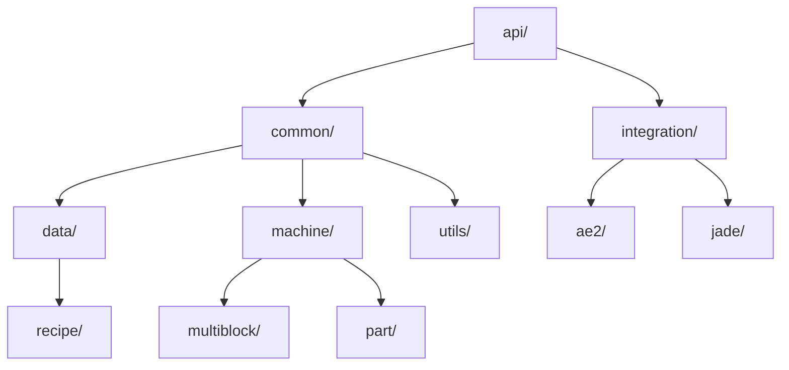
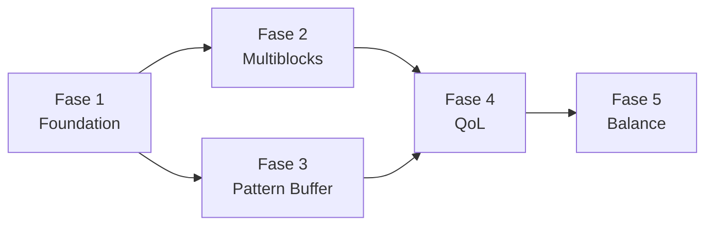

# 🔧 PRD #2 — Developer Guide & Implementation Plan
## GregTech Nexus Addon — Technical Implementation Document
### Versão 1.0 | Bilíngue PT-BR / EN

---

## 📋 Índice

1. [Visão Técnica / Technical Overview](#1-visão-técnica--technical-overview)
2. [Estrutura de Pastas / Folder Structure](#2-estrutura-de-pastas--folder-structure)
3. [Padrões de Código / Coding Standards](#3-padrões-de-código--coding-standards)
4. [Ordem de Implementação / Implementation Order](#4-ordem-de-implementação--implementation-order)
5. [Guia de Cálculos Massivos / Large Number Calculation Guide](#5-guia-de-cálculos-massivos--large-number-calculation-guide)
6. [Padrões de Registro / Registration Patterns](#6-padrões-de-registro--registration-patterns)
7. [Padrões de Multiblock / Multiblock Patterns](#7-padrões-de-multiblock--multiblock-patterns)
8. [Testing & Debugging](#8-testing--debugging)
9. [Guia para Contribuidores / Contributor Guide](#9-guia-para-contribuidores--contributor-guide)

---

## 1. Visão Técnica / Technical Overview

### Stack Tecnológica

| Componente | Versão | Papel |
|-----------|--------|-------|
| Minecraft | 1.20.1 | Runtime |
| Forge | 47.4.1 | Mod Loader |
| GregTech CEu Modern | 7.4.1 | API Base |
| LDLib | 1.0.40.b | GUI/Rendering |
| Registrate | MC1.20-1.3.11 | Registration DSL |
| Applied Energistics 2 | Latest 1.20.1 | Storage/Autocraft |
| ExtendedAE | Latest | AE2 Addon |
| Java | 17 | Language |
| Lombok | 1.18.24 | Boilerplate reduction |

### Dependência entre Módulos



---

## 2. Estrutura de Pastas / Folder Structure

### Estrutura Atual (Problemas Identificados)

```
com.raishxn.gtna/
├── GTNACORE.java               ← MOD principal
├── GTNAGTAddon.java            ← GT Addon entry
├── api/                        ← OK, mas precisa expandir
│   ├── data/info/
│   ├── item/tool/
│   ├── machine/
│   │   └── multiblock/
│   └── registry/
├── client/                     ← OK
├── common/
│   ├── data/                   ← ⚠️ Mistura materials, machines, blocks
│   │   ├── material/
│   │   ├── GTNABlocks.java
│   │   ├── GTNAElements.java
│   │   ├── GTNAItems.java
│   │   ├── GTNAMachines.java   ← ⚠️ 1620 linhas! Dividir.
│   │   ├── GTNAMachines2.java  ← ⚠️ Continuação, naming confuso
│   │   └── GTNAMaterials.java
│   ├── item/
│   ├── machine/
│   │   └── multiblock/
│   │       ├── electric/
│   │       ├── energy/
│   │       ├── noenergy/
│   │       ├── part/
│   │       │   └── steam/
│   │       └── steam/
│   └── recipe/                 ← ⚠️ Está em common, deveria estar em data
├── config/
├── data/
│   └── recipe/                 ← ⚠️ Duplicação com common/recipe
├── integration/
├── mixin/
├── network/
└── utils/
```

### Estrutura Proposta (Refatorada)

```
com.raishxn.gtna/
├── GTNACORE.java
├── GTNAGTAddon.java
│
├── api/                                    ← Interfaces públicas para addons
│   ├── capability/                         ← [NOVO] Capabilities customizadas
│   │   ├── IPatternBuffer.java
│   │   └── ISteamNetwork.java
│   ├── data/
│   │   ├── chemical/                       ← [NOVO] Elementos e materiais API
│   │   │   ├── GTNAElements.java           ← Movido de common/data
│   │   │   └── GTNAMaterialFlags.java
│   │   └── info/
│   ├── item/tool/
│   ├── machine/
│   │   ├── multiblock/
│   │   │   ├── GTNAPartAbility.java
│   │   │   └── IThreadModifierMachine.java
│   │   └── trait/                          ← [NOVO]
│   │       ├── IPatternBufferProvider.java
│   │       └── ISteamOverclockable.java
│   └── registry/
│
├── client/
│   ├── ClientProxy.java
│   ├── gui/                                ← [NOVO] GUIs customizadas
│   │   ├── widget/
│   │   │   ├── PatternBufferWidget.java
│   │   │   └── SteamDashboardWidget.java
│   │   └── screen/
│   └── renderer/                           ← [NOVO] Custom renders
│
├── common/
│   ├── CommonProxy.java
│   ├── block/                              ← [RENOMEADO] de data/GTNABlocks
│   │   ├── GTNABlocks.java
│   │   └── casing/                         ← [NOVO] Specific casing logic
│   │       └── PressureCoreBlock.java
│   ├── cover/
│   │   └── GTNACovers.java
│   ├── item/
│   │   ├── GTNAItems.java
│   │   └── behavior/                       ← [RENOMEADO]
│   │       ├── StructureDetectBehavior.java
│   │       └── StructureWriteBehavior.java
│   ├── machine/
│   │   ├── multiblock/
│   │   │   ├── electric/
│   │   │   │   └── WorkableElectricMultipleRecipesMachine.java
│   │   │   ├── steam/                      ← [UNIFICADO] steam + noenergy
│   │   │   │   ├── ForgeOfTheIronCrown.java       ← [NOVO]
│   │   │   │   ├── SteamPressureCrystallizer.java ← [NOVO]
│   │   │   │   ├── PneumaticOreWasher.java        ← [NOVO]
│   │   │   │   ├── SteamDistillationColumn.java   ← [NOVO]
│   │   │   │   ├── HydraulicPressComplex.java     ← [NOVO]
│   │   │   │   ├── LargeSteamAlloySmelter.java
│   │   │   │   ├── LargeSteamCrusher.java
│   │   │   │   ├── LargeSteamFurnace.java
│   │   │   │   ├── MegaSolarBoilerMachine.java
│   │   │   │   ├── SteamCobbler.java
│   │   │   │   ├── SteamManufacturer.java
│   │   │   │   ├── SteamWoodcutter.java
│   │   │   │   ├── StoneSuperHeater.java
│   │   │   │   └── VoidMinerSteamGateAged.java
│   │   │   ├── energy/
│   │   │   │   ├── IndustrialSlaughterhouse.java
│   │   │   │   └── NexusReactorCore.java          ← [NOVO]
│   │   │   └── part/
│   │   │       ├── AccelerateHatchPartMachine.java
│   │   │       ├── AdvancedParallelHatchPartMachine.java
│   │   │       ├── OverclockHatchPartMachine.java
│   │   │       ├── PatternBufferPartMachine.java  ← [NOVO]
│   │   │       ├── ThreadPartMachine.java
│   │   │       └── steam/
│   │   └── trait/
│   │       ├── GTNAMultipleRecipesLogic.java
│   │       └── PatternBufferLogic.java            ← [NOVO]
│   └── network/                                   ← [MOVIDO] de top-level
│       ├── GTNANetworkHandler.java
│       └── packet/
│
├── config/
│   └── ConfigHolder.java
│
├── data/                                          ← Registration de TUDO
│   ├── lang/
│   │   └── GTNALangProvider.java
│   ├── material/
│   │   ├── GTNAMaterials.java
│   │   ├── MaterialBuilder.java
│   │   └── MaterialAdd.java
│   ├── machine/                                   ← [NOVO] Dividido por era
│   │   ├── GTNAMachinesSteam.java                 ← Máquinas era vapor
│   │   ├── GTNAMachinesHydraulic.java             ← Máquinas era hidráulica
│   │   ├── GTNAMachinesParts.java                 ← Hatches e parts
│   │   └── GTNAMachinesElectric.java              ← Máquinas elétricas
│   ├── recipe/
│   │   ├── GTNARecipeType.java
│   │   ├── handler/                               ← [NOVO] por categoria
│   │   │   ├── SteamEraRecipes.java
│   │   │   ├── HydraulicEraRecipes.java
│   │   │   ├── CraftingRecipes.java
│   │   │   └── MaterialProcessingRecipes.java
│   │   └── condition/                             ← [NOVO]
│   │       └── GTNARecipeConditions.java
│   └── tag/
│       └── GTNATagPrefix.java
│
├── integration/
│   ├── ae2/                                       ← [NOVO] Integração AE2
│   │   ├── PatternBufferAE2Handler.java
│   │   └── MEPatternBufferPart.java
│   └── jade/
│       ├── GTNAJadePlugin.java
│       └── provider/
│
├── mixin/
│   └── gtceu/
│       ├── GTNAPlateDoubleMixin.java
│       └── GTRecipeLogicMixin.java
│
└── utils/
    ├── GTNARecipeHelper.java
    ├── GTNARecipeUtils.java
    ├── GTNAUtil.java
    ├── MachineIO.java
    ├── MachineUtil.java
    ├── NumberUtils.java
    ├── Registries.java
    ├── StructureSlicer.java
    ├── TextUtil.java
    ├── ThreadMultiplierStrategy.java
    ├── calc/                                      ← [NOVO] Cálculos
    │   ├── EfficiencyCalculator.java
    │   ├── SteamConversionTable.java
    │   └── OverclockCalculator.java
    └── datastructure/
        ├── CacheState.java
        ├── GTRecipe2IntBiMultiMap.java
        └── Int128.java
```

> [!IMPORTANT]
> **A refatoração deve ser feita INCREMENTALMENTE:**
> 1. Primeiro: dividir GTNAMachines.java (1620 linhas) em módulos por era
> 2. Segundo: mover receitas para data/recipe/handler/
> 3. Terceiro: criar a pasta api/capability/
> 4. Quarto: implementar novos features no novo layout

---

## 3. Padrões de Código / Coding Standards

### 3.1 Naming Conventions

```java
// ✅ BOM: Classes de multiblock seguem o padrão [Nome]Machine
public class ForgeOfTheIronCrown extends SteamMultiMachineBase { }
public class SteamPressureCrystallizer extends SteamMultiMachineBase { }

// ❌ RUIM: Nomes genéricos ou abreviados
public class FoIC extends SteamMultiMachineBase { }
public class Machine1 extends SteamMultiMachineBase { }

// ✅ BOM: Constantes de registro seguem UPPER_SNAKE_CASE
public static final MultiblockMachineDefinition FORGE_OF_THE_IRON_CROWN = ...;

// ✅ BOM: Materiais seguem PascalCase
public static Material PressurizedBronze;
public static Material SteamHardenedIron;

// ✅ BOM: IDs de registro seguem snake_case
GTNACORE.id("forge_of_the_iron_crown")
GTNACORE.id("pressurized_bronze")
```

### 3.2 Organização de Imports

```java
// Ordem de imports:
// 1. GTCEu/LDLib
import com.gregtechceu.gtceu.api.*;
import com.lowdragmc.lowdraglib.*;

// 2. GTNA (nosso)
import com.raishxn.gtna.*;

// 3. Minecraft/Forge
import net.minecraft.*;
import net.minecraftforge.*;

// 4. Java standard
import java.util.*;
```

### 3.3 Padrões para Recipe Modifiers

```java
/**
 * Padrão para recipeModifier em multiblocks GTNA.
 * SEMPRE documente:
 * - O que o modifier faz
 * - Fórmulas usadas
 * - Parâmetros que afetam o resultado
 */
public static GTRecipe recipeModifier(MetaMachine machine, GTRecipe recipe, 
                                       @NotNull OCParams params, 
                                       @NotNull OCResult result) {
    // 1. Valide a máquina
    if (!(machine instanceof ForgeOfTheIronCrown forgeMachine)) {
        return recipe;
    }
    
    // 2. Calcule paralelos
    int maxParallel = forgeMachine.getMaxParallel();
    var parallelResult = GTRecipeModifiers.fastParallel(machine, recipe, maxParallel, false);
    
    // 3. Aplique modificadores de velocidade
    // Fórmula: duration = base / (1 + 0.5 * ocLevel)
    recipe = parallelResult.getFirst();
    int ocLevel = forgeMachine.getSteamOverclockLevel();
    int newDuration = (int) (recipe.duration / (1 + 0.5 * ocLevel));
    recipe = recipe.copy();
    recipe.duration = Math.max(1, newDuration);
    
    // 4. Aplique Crown Bonus se aplicável
    if (forgeMachine.hasCrownBonus()) {
        recipe.duration = (int) (recipe.duration * 0.9); // 10% faster
    }
    
    // 5. Ajuste consumo de steam
    long steamCost = calculateSteamCost(recipe, ocLevel);
    // ... apply steam cost
    
    return recipe;
}
```

### 3.4 Lombok Usage

```java
// USE Lombok para reduzir boilerplate, mas COM MODERAÇÃO:
@Getter  // ✅ Em fields simples
@Setter  // ✅ Em fields mutáveis
@Getter(lazy = true) // ✅ Para computações caras

// ❌ NÃO USE @Data em classes de máquina (pode causar problemas com serialização GT)
// ❌ NÃO USE @Builder em classes que estendem GT (conflito com super construtores)
```

### 3.5 Javadoc Obrigatório

```java
/**
 * Toda classe pública DEVE ter Javadoc com:
 * - Descrição em PT-BR e EN
 * - @author
 * - @since (versão do GTNA)
 * 
 * PT-BR: Forja da Coroa de Ferro — Multiblock movido a vapor que funciona 
 *        como EBF para receitas ≤1800K.
 * EN: Forge of the Iron Crown — Steam-powered multiblock functioning as 
 *     EBF for recipes ≤1800K.
 * 
 * @author raishxn
 * @since 0.2.0
 * @see SteamMultiMachineBase
 */
public class ForgeOfTheIronCrown extends SteamMultiMachineBase {
```

---

## 4. Ordem de Implementação / Implementation Order

### Fase 1: Foundation (v0.2.0-alpha)
**Prioridade: CRÍTICA | Estimativa: 2-3 semanas**

```
1. [  ] Refatorar GTNAMachines.java → dividir em módulos por era
2. [  ] Registrar novos Elementos (Nexium, Steamforged, Crystallium)
3. [  ] Registrar novas Ligas (PressurizedBronze, SteamHardenedIron, PneumaticSteel)
4. [  ] Criar novos blocos (PressureCore, novos casings)
5. [  ] Registrar novos RecipeTypes (crystallizer, pneumatic_washer, distillation_steam)
6. [  ] Criar novos fluidos (Crystal Coolant, Hydraulic Fluid, Pressurized Water)
```

### Fase 2: Core Multiblocks (v0.2.0-beta)
**Prioridade: ALTA | Estimativa: 3-4 semanas**

```
7. [  ] Implementar ForgeOfTheIronCrown (mais complexo, fazer primeiro)
8. [  ] Implementar SteamPressureCrystallizer
9. [  ] Implementar PneumaticOreWasher
10. [  ] Implementar SteamDistillationColumn
11. [  ] Implementar HydraulicPressComplex
12. [  ] Criar todas as receitas dos novos multiblocks
13. [  ] Criar texturas (programmaticamente ou via Asset Generator)
```

### Fase 3: Pattern Buffer (v0.2.0-rc)
**Prioridade: ALTA | Estimativa: 2-3 semanas**

```
14. [  ] Implementar PatternBufferPartMachine (lógica core)
15. [  ] Implementar PatternBufferLogic (trait)
16. [  ] Criar GUI do Pattern Buffer (widgets LDLib)
17. [  ] Registrar 5 tiers de Pattern Buffer
18. [  ] Integração AE2 para Pattern Buffer
19. [  ] Testes de integração
```

### Fase 4: QoL & Polish (v0.2.0-release)
**Prioridade: MÉDIA | Estimativa: 1-2 semanas**

```
20. [  ] Smart Tooltips em todos os multiblocks
21. [  ] Wireless Steam Dashboard GUI
22. [  ] Structure Preview Enhancement
23. [  ] JEI/EMI custom pages
24. [  ] Tradução PT-BR/EN completa
25. [  ] Debug tools e config options
```

### Fase 5: Balanceamento & Testing (v0.2.0-final)
**Prioridade: CRÍTICA | Estimativa: 1-2 semanas**

```
26. [  ] Testes de performance (TPS impact)
27. [  ] Testes de gameplay (speedrun completa)
28. [  ] Balance pass em todos os custos/durações
29. [  ] Community playtest (se possível)
30. [  ] Documentação final
```

### Dependência entre Fases



---

## 5. Guia de Cálculos Massivos / Large Number Calculation Guide

### 5.1 O Problema dos Números Grandes

No GT endgame, lidamos com valores que excedem `int` e às vezes `long`:
- Steam: até 2,147,483,647 L/t (int max) em redes grandes
- EU: até 9,223,372,036,854,775,807 (long max) em tier MAX
- Paralelos: até 262,144 (seus parallel hatches OpV)

### 5.2 Já Temos: Int128

```java
// O projeto já possui Int128 em utils/datastructure/
// USE para cálculos que excedem long
import com.raishxn.gtna.utils.datastructure.Int128;

// Exemplo: calcular custo total de steam para 262,144 paralelos
Int128 totalSteam = Int128.of(baseSteamPerTick)
    .multiply(Int128.of(parallels))
    .multiply(Int128.of(durationTicks));
```

### 5.3 Estratégias de Cálculo

```java
/**
 * REGRA 1: Sempre use long para cálculos intermediários de EU/Steam
 * REGRA 2: Use Int128 quando multiplicando 3+ valores que podem overflow
 * REGRA 3: Arredonde PARA CIMA custos (Math.ceil), PARA BAIXO benefícios (Math.floor)
 * REGRA 4: Nunca divida antes de multiplicar (perda de precisão)
 */

// ✅ BOM: Multiplica primeiro, divide depois
long efficiency = (baseCost * parallels * 100L) / efficiencyPercent;

// ❌ RUIM: Divide primeiro, perde precisão
long efficiency = (baseCost / efficiencyPercent) * parallels * 100;

// ✅ BOM: Usa saturação para evitar overflow
long safeSteam = Math.min(totalSteam, Integer.MAX_VALUE);

// ✅ BOM: Usa BigInteger para display (tooltip), long para lógica
BigInteger displayValue = BigInteger.valueOf(totalSteam);
String formatted = NumberFormat.getCompactNumberInstance().format(displayValue);
```

### 5.4 Tabela de Limites

| Tipo | Valor Máximo | Quando Usar |
|------|-------------|-------------|
| `int` | 2.1 bilhões | Fluid em mB, durações curtas |
| `long` | 9.2 quintilhões | EU totais, cálculos intermediários |
| `Int128` | 1.7×10³⁸ | Cálculos de endgame, display |
| `BigInteger` | Ilimitado | Apenas para display/formatting |

### 5.5 Funções Utilitárias Recomendadas

```java
public class GTNAMathUtils {
    
    /**
     * Multiplica sem overflow, retorna Long.MAX_VALUE se exceder
     */
    public static long safeMul(long a, long b) {
        try {
            return Math.multiplyExact(a, b);
        } catch (ArithmeticException e) {
            return Long.MAX_VALUE;
        }
    }
    
    /**
     * Calcula custo de steam com proteção de overflow
     * @param baseCost custo base em L/t
     * @param parallels número de paralelos ativos
     * @param efficiencyMod modificador de eficiência (0.7 para Steamforged)
     * @param ocLevel nível de overclock (0-3)
     */
    public static long calculateSteamCost(long baseCost, int parallels, 
                                           double efficiencyMod, int ocLevel) {
        long cost = baseCost;
        cost = safeMul(cost, parallels);
        cost = (long) (cost * efficiencyMod);
        cost = safeMul(cost, (long) Math.pow(2, ocLevel));
        return cost;
    }
    
    /**
     * Formata números grandes para tooltips
     * 1000 → "1K", 1000000 → "1M", etc.
     */
    public static String formatCompact(long value) {
        if (value < 1_000) return String.valueOf(value);
        if (value < 1_000_000) return String.format("%.1fK", value / 1_000.0);
        if (value < 1_000_000_000) return String.format("%.1fM", value / 1_000_000.0);
        return String.format("%.1fB", value / 1_000_000_000.0);
    }
}
```

---

## 6. Padrões de Registro / Registration Patterns

### 6.1 Registrar um Novo Elemento

```java
// Em api/data/chemical/GTNAElements.java (ou common/data/GTNAElements.java)
public class GTNAElements {
    public static Element ECHOITE;
    public static Element NEXIUM;
    public static Element STEAMFORGED;
    public static Element CRYSTALLIUM;
    // ...
    
    public static void init() {
        // Params: protons, neutrons, halfLifeSeconds (-1 = stable), 
        //         decayTo, name, symbol, isIsotope
        ECHOITE = GTElements.createAndRegister(570, 570, -1, null, "echoite", "Ec", false);
        
        NEXIUM = GTElements.createAndRegister(571, 580, -1, null, "nexium", "Nx", false);
        
        STEAMFORGED = GTElements.createAndRegister(573, 560, -1, null, "steamforged", "Sf", false);
        
        CRYSTALLIUM = GTElements.createAndRegister(574, 575, -1, null, "crystallium", "Cr★", false);
    }
}
```

### 6.2 Registrar um Novo Material

```java
// Em data/material/MaterialBuilder.java
public static void init() {
    // Liga simples
    PressurizedBronze = new Material.Builder(GTNACORE.id("pressurized_bronze"))
        .ingot().fluid().dust()
        .color(0xCD8032)                          // Cor da liga
        .iconSet(MaterialIconSet.SHINY)           // Aparência visual
        .components(Bronze, 3, CompressedSteam, 1) // Composição
        .blastTemp(900, BlastProperty.GasTier.LOW) // Temperatura EBF
        .flags(GENERATE_PLATE, GENERATE_ROD, GENERATE_FRAME, GENERATE_GEAR,
               GENERATE_BOLT_SCREW, GENERATE_DENSE)
        .fluidPipeProperties(900, 2000, true, true, true, false)
        .buildAndRegister()
        .setFormula("(SnCu3)3(H2O)");
    
    // Elemento puro
    Nexium = new Material.Builder(GTNACORE.id("nexium"))
        .ingot().fluid().dust().plasma()
        .element(GTNAElements.NEXIUM)             // Vincula ao elemento
        .color(0x4A7AE5)
        .iconSet(MaterialIconSet.METALLIC)
        .blastTemp(1600, BlastProperty.GasTier.MID)
        .flags(GENERATE_PLATE, GENERATE_ROD, GENERATE_FRAME, GENERATE_GEAR,
               GENERATE_BOLT_SCREW, GENERATE_FINE_WIRE, GENERATE_FOIL)
        .cableProperties(GTValues.V[GTValues.MV], 32, 0, true) // Cabo MV sem perda
        .buildAndRegister()
        .setFormula("Nx");
}
```

### 6.3 Registrar um Novo Bloco de Casing

```java
// Em common/block/GTNABlocks.java
public static final BlockEntry<Block> PRESSURE_CORE = createCasingBlock("pressure_core");

// Para blocos com lógica especial:
public static final BlockEntry<PressureCoreBlock> ADVANCED_PRESSURE_CORE = REGISTRATE
    .block("advanced_pressure_core", PressureCoreBlock::new)
    .initialProperties(() -> Blocks.IRON_BLOCK)
    .properties(p -> p.mapColor(MapColor.METAL).strength(8.0f, 10.0f).sound(SoundType.NETHERITE_BLOCK))
    .addLayer(() -> RenderType::solid)
    .blockstate((ctx, prov) -> prov.simpleBlock(ctx.get(), 
        prov.models().cubeAll(ctx.getName(), GTNACORE.id("block/casings/pressure_core"))))
    .tag(GTToolType.WRENCH.harvestTags.get(0), BlockTags.MINEABLE_WITH_PICKAXE)
    .item(BlockItem::new).build()
    .register();
```

### 6.4 Registrar um Novo Recipe Type

```java
// Em data/recipe/GTNARecipeType.java
public static final String CRYSTALLIZER = "crystallizer";
public static final GTRecipeType CRYSTALLIZER_RECIPES = register("crystallizer", CRYSTALLIZER)
    .setMaxIOSize(2, 2, 2, 2)  // max item in, item out, fluid in, fluid out
    .setEUIO(IO.IN)
    .setProgressBar(GuiTextures.PROGRESS_BAR_CRYSTALLIZE, LEFT_TO_RIGHT)
    .setSound(GTSoundEntries.CHEMICAL);

public static final String PNEUMATIC_WASH = "pneumatic_wash";
public static final GTRecipeType PNEUMATIC_WASH_RECIPES = register("pneumatic_wash", PNEUMATIC_WASH)
    .setMaxIOSize(1, 4, 2, 2)
    .setEUIO(IO.IN)
    .setProgressBar(GuiTextures.PROGRESS_BAR_BATH, LEFT_TO_RIGHT)
    .setSound(GTSoundEntries.BATH);
```

---

## 7. Padrões de Multiblock / Multiblock Patterns

### 7.1 Template Base para Novo Multiblock GTNA

```java
/**
 * Template: [NomeDoMultiblock].java
 * 
 * Copie este template e modifique para cada novo multiblock.
 * Siga a ordem: fields → constructor → recipe modifier → pattern → tooltips
 */
public class TemplateMultiblock extends SteamMultiMachineBase {

    // ═══ FIELDS ═══
    private final int maxParallel;
    private final double speedMultiplier;
    
    // ═══ CONSTRUCTOR ═══
    public TemplateMultiblock(IMachineBlockEntity holder, Object... args) {
        super(holder, args);
        this.maxParallel = 64;
        this.speedMultiplier = 2.0;
    }
    
    // ═══ RECIPE MODIFIER ═══
    @Nullable
    public static GTRecipe recipeModifier(MetaMachine machine, @NotNull GTRecipe recipe,
                                           @NotNull OCParams params, @NotNull OCResult result) {
        if (!(machine instanceof TemplateMultiblock tmb)) return recipe;
        
        // Parallel
        var parallel = GTRecipeModifiers.fastParallel(machine, recipe, tmb.maxParallel, false);
        recipe = parallel.getFirst();
        
        // Speed
        recipe = recipe.copy();
        recipe.duration = Math.max(1, (int)(recipe.duration / tmb.speedMultiplier));
        
        // Steam cost (se aplicável)
        // ...
        
        return recipe;
    }
    
    // ═══ PATTERN ═══
    // Defina na registration class (GTNAMachinesSteam.java)
    // Padrão: use GTNACORE.id() para todas as ResourceLocations
    
    // ═══ TICK LOGIC (se necessário) ═══
    @Override
    public void onWorking() {
        super.onWorking();
        // Lógica por tick (consumo de steam, efeitos visuais, etc.)
    }
}
```

### 7.2 Dicas para Definição de Patterns

```java
// 1. SEMPRE use 'S' ou '~' para controller
// 2. Use letras consistentes: A=main casing, B=special, C=pipe, etc.
// 3. Espacos ' ' para any(), '#' para air()
// 4. Documente cada letra com comentário

.where('~', controller(blocks(definition.get())))
.where('A', blocks(GTNABlocks.SOME_CASING.get())             // Main casing + abilities
    .or(abilities(PartAbility.STEAM_IMPORT_ITEMS).setPreviewCount(1))
    .or(abilities(PartAbility.STEAM_EXPORT_ITEMS).setPreviewCount(1))
    .or(abilities(PartAbility.STEAM).setExactLimit(1)))
.where('B', blocks(GTNABlocks.SPECIAL_BLOCK.get()))           // Bloco especial (sem hatch)
.where('C', blocks(GTBlocks.CASING_BRONZE_PIPE.get()))        // Pipe interior
.where('D', blocks(ChemicalHelper.getBlock(TagPrefix.frameGt, GTMaterials.Steel)))
.where(' ', any())                                             // Pode ser qualquer bloco
.where('#', air())                                             // Deve ser ar
```

---

## 8. Testing & Debugging

### 8.1 Ambiente de Desenvolvimento

```
1. IntelliJ IDEA (recomendado)
   - Plugin: Minecraft Development
   - Plugin: Lombok
   - Configuração de Run: "runClient" via Gradle
   
2. Comandos úteis in-game:
   /gtna debug <machine_id>     → Mostra stats da máquina
   /gtna steam_network          → Mostra estado da rede wireless
   /gtna give_materials          → Dá materiais de teste
   
3. Estrutura de teste:
   src/test/java/com/raishxn/gtna/
   ├── recipe/RecipeValidationTest.java
   ├── calc/CalculationTest.java
   └── material/MaterialRegistrationTest.java
```

### 8.2 Checklist de Testes por Feature

```
Para cada novo multiblock:
[  ] Forma corretamente (structure check)
[  ] Aceita receitas corretas
[  ] Rejeita receitas incorretas
[  ] Paralelos funcionam como esperado
[  ] Consumo de steam bate com as fórmulas
[  ] Subprodutos são gerados corretamente
[  ] Wall sharing funciona
[  ] Tooltips mostram informações corretas
[  ] JEI/EMI mostra a máquina
[  ] Não causa TPS lag com 10+ instâncias
```

### 8.3 Debugging de Performance

```java
// Use o MachineUtil existente para profiling:
public static void profileRecipeExecution(String machineName, Runnable execution) {
    long start = System.nanoTime();
    execution.run();
    long elapsed = System.nanoTime() - start;
    if (elapsed > 1_000_000) { // > 1ms
        GTNACORE.LOGGER.warn("[PERF] {} took {}ms", machineName, elapsed / 1_000_000.0);
    }
}
```

---

## 9. Guia para Contribuidores / Contributor Guide

### Para quem quiser fazer addons para o GTNA:

```java
// 1. Adicione GTNA como dependência no build.gradle:
modImplementation("com.raishxn.gtna:gtna-1.20.1:${gtna_version}:slim") { 
    transitive = false 
}

// 2. Use as interfaces da API:
import com.raishxn.gtna.api.capability.IPatternBuffer;
import com.raishxn.gtna.api.machine.trait.ISteamOverclockable;

// 3. Registre receitas para nossos recipe types:
import static com.raishxn.gtna.data.recipe.GTNARecipeType.CRYSTALLIZER_RECIPES;

// 4. Estenda nossos materiais:
import com.raishxn.gtna.data.material.GTNAMaterials;
```

### Workflow Recomendado (Git)

```
main ← production releases
├── develop ← integration branch
│   ├── feature/forge-of-iron-crown
│   ├── feature/pattern-buffer
│   ├── feature/new-materials
│   └── fix/steam-calculation-overflow
└── release/0.2.0 ← release candidate
```

---

*Documento técnico do GTNA v0.2.0 — Para desenvolvedores e contribuidores*
